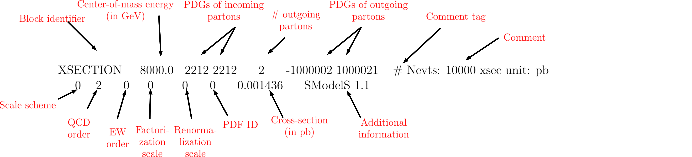

# SModelS2 说明文档

**作者：** 贾兴隆

`SmodelS` 是一个使用 LHC 数据限制粒子物理简化模型的 `Python` 自动化工具，目前最新版本的 `SmodelS` 对 `Python` 版本的要求为 **3.6** 及以上。它的运行流程整体上分为两个步骤。第一步是将 BSM 模型拆解为简化模型的拓扑情形。第二步是根据 LHC 数据对这些拓扑情形做出限制。根据本文档所撰写的时间，当前文档多以 `SmodelS-2.3.0` 为例进行介绍，不过其中的大部分内容对于不同版本来说都是通用的。`SmodelS` 是一个规模庞大的程序包，本文档所讨论的内容十分有限，大多数介绍仅停留在最必要的部分，对于很多遗留的内容希望有心之人可以进行添加。

## SModelS 官方网站

- 官网：<https://smodels.github.io/>
- 用户手册：<https://smodels.readthedocs.io/en/stable/>
- GitHub：<https://github.com/SModelS/smodels>
- 数据库 GitHub：<https://github.com/SModelS/smodels-database-release>

## 安装 SModelS

### SModelS 依赖项

`SmodelS` 是一个使用 `Python` 语言编写的程序包，同时也用到了许多 `Python` 的扩展模块。因此在安装和使用 `SmodelS` 之前首先，要确保 `Python` 以及这些依赖项的版本要求得到了满足，可以使用 `pip install` 或者 `conda install` 命令安装这些依赖，也可以通过使用 `setuptools` 的方式安装 `SmodelS` 以避免逐一安装这些依赖项。

**这些依赖项包括：**

```text
- docutils>=0.3
- numpy>=1.18.0,!=1.21.*
- scipy>=1.0.0
- unum>=4.0.0
- requests>=2.0.0
- pyslha>=3.1.0
- pyhf>=0.6.1
- jsonpatch>=1.25
- jsonschema>=3.2.0
```

这里需要特别提一下 `pyslha` 和 `pyhf` 这两个库：

- `pyslha` 库是一个用于读取和解析 SLHA 格式文本文件的库。
- `pyhf` 库是一个用于处理高能物理中统计问题的库。此外，如果有条件的话可以安装 `pytorch>=1.8.0` 作为 `pyhf` 的计算后端，这可以提升运行速度。

除此以外 `SmodelS` 还提供了一些可选功能，这些可选功能对环境有一些额外的依赖：

- 如果要使用 `SmodelS` 的截面计算器，则系统需要安装 `C++` 以及 `fortran` 编译器，`SmodelS` 会使用它们安装 `Pythia 8.3` 以及 `NLL-fast`。
- 数据库浏览功能需要安装 `IPython`。
- 交互式绘图功能需要安装 `plotly` 以及 `Pandas`。

### SModelS 安装方法

在安装完所有必要的依赖后就可以开始安装 `SmodelS` 了，一共有三种方法可以安装。

#### 源代码安装（推荐）

从 GitHub 上可以下载到 `SmodelS` 源代码文件 `smodels-X.X.X.tar.gz`，解压后可得到 `smodels-X.X.X` 文件，进入到 `smodels-X.X.X` 文件中即可执行安装命令。

在运行安装命令之前，可执行以下脚本检查依赖：

```bash
./smodelsTools.py toolbox
```

检查无误后即可运行以下命令进行安装:

```bash
make smodels
```

如果不需要安装 `Pythia` 以及 `NLL-fast` 可以使用以下命令进行安装：

```bash
make smodels_noexternaltools
```

#### 使用 setuptools 安装

该方法同样需要下载源代码文件，如果当前环境安装了 `Python` 的 `setuptools` 库，即可使用以下命令进行安装：

```bash
setup.py install
```

如果使用这种安装方法，则不需要提前安装所有的依赖项，该脚本会自动处理所有依赖问题。

如果因为需要改动系统目录，没有权限而导致执行失败的话，则需要使用 `sudo` 命令获得权限，或者可以使用以下命令安装到用户目录下：

```bash
setup.py install --user
```

#### 使用 pip 安装

`SmodelS` 也可以使用 `pip` 直接安装，命令是：

```bash
pip install smodels
```

这种方式同样不需要提前处理依赖问题，`pip` 会自动下载所需的依赖项。

在这种情况下 `SmodelS` 以及示例文件和参数文件会直接安装到特定的 `Python` 包目录中，具体依赖于所使用的 `Python` 环境。此时可能需要调整某些环境变量，如 `$PATH, $PYTHONPATH, $LD_LIBRARY_PATH`。数据库文件例外，可以不安装到该目录中。

如果遇到权限问题的话，则需要使用 `sudo` 命令获得权限，或者可以使用以下命令进行安装：

```bash
pip install --user smodels 
```

这种方式只推荐比较有经验的 `Python` 使用者使用。

## SModelS Database

`SmodelS` 数据库包含 LHC 相关的数据，`SmodelS` 正是通过对比简化模型的拓扑结构以及数据库信息从而得出对特定模型的 LHC 限制。

### 数据库的类型

`SmodelS` 数据库一共有两种类型的数据，分别是 `UL` 类型和 `EM` 类型。

- `UL` 类型是 `SmodelS` 中大多数数据的数据类型，指的是以产生截面的上限来作为限制的来源。
- `EM` 类型是以产生效率来作为限制的来源。

这部分可以详见：<https://smodels.readthedocs.io/en/stable/DatabaseDefinitions.html#emtype>

### SModelS Database 的安装方法

新下载安装的 `SmodelS` 不自带数据库，需要进行安装。

以下载源代码安装为例，解压后的文件夹中存在一个名为 `parameters.ini` 的文件，这是 `SmodelS` 的配置文件。其中有一项配置是 `[database]`，该项配置负责设定数据库文件所在的位置。具体的安装方法有两种。

#### 使用内置的官方链接

最简单的方式是使用官方内置的链接作为数据库路径，这种方式需要确保网络连接通畅，能够连接到 `SModelS Database` 的网络地址。设置配置文件中的 `[database]` 项为以下内容即可：

```ini
path = official
```

在这种情况下，运行 `SmodelS` 会自动下载相应版本的数据库二进制文件。默认情况下，数据库会被下载到用户的 `.cache/smodels/` 目录下。如果想把数据库缓存至其他位置，则需要设置环境变量 `SMODELS_CACHEDIR`，数据库会缓存至该环境变量所指向的目录。

从 v2.2.0 版本开始，部分 `EM` 类型的数据在官方数据库中被进行了整合和汇总，这能加快运行速度。如果不想使用整合后的数据，可以使用以下命令安装数据库

```ini
path = official+nonaggregated
```

#### 手动下载数据库

另一种方式是自行前往数据库的 GitHub 地址下载数据库

数据库的 GitHub 地址是：<https://github.com/SModelS/smodels-database-release>

下载后可解压至任意位置，只需要在 `[database]` 项中指定与参数文件的相对路径或绝对路径即可，例如，若数据库文件放置于与参数文件同一级目录的话：

```ini
path = ./smodels-database/
```

同样的，如果不想使用被整合的 `EM` 类型数据，则解压   `smodels-database` 中的 `nonaggregated220.tar.gz` 文件即可。

如果选择这种方式安装数据库，那么安装完成后首次运行 `SmodelS` 时，`SmodelS` 会自动使用数据库中的文本文件生成二进制文件。

## 使用 SModelS

`SmodelS` 可以接收 SLHA 以及 LHE 格式的文件作为输入文件，并通过计算得出对该文件所对应参数点的 LHC 限制。`SModelS` 提供了包括命令行工具，以及自定义脚本在内的两种运行方式。如果输入模型为非 `MSSM` 模型，用户可能需要自行在 `model.py` 中定义 BSM 粒子。

### `SmodelS` 的输入文件

此处暂时只介绍 SLHA 格式文件作为输入文件的情形。

`SmodelS` 可以读取标准的 SLHA 格式文件，从而获取相应的所有信息。但 SLHA 格式文件并不包含对撞机产生 BSM 粒子的产生截面信息，因此这一部分信息需要自行添加。

下面是一个标准的截面信息描述格式的示例，这样的一个描述截面信息的 Block 在 `SModelS` 中被称为 `元素(element)`

```SLHA
XSECTION SQRTS PDG_CODE1 PDG_CODE2 NF PDG_CODE3 PDG_CODE4
SCALE_SCHEME QCD_ORDER EW_ORDER KAPPA_F KAPPA_R  PDF_ID VALUE CODE VERSION
```

第一行的含义分别是：

- XSECTION: Block 标记。当 `SmodelS` 读取 SLHA 文件时，读取到该标记就能知道这部分为截面信息
- SQRTS: 一个浮点数，对撞机质心能，单位为 GeV
- PDG_CODE1 PDG_CODE2: 均为整数，对撞粒子的 PDG 编号，质子为 2212
- NF: 一个整数，末态粒子的数量
- PDG_CODE3 PDG_CODE4 ... : 均为整数，末态粒子的 PDG 编号

第二行的含义分别是：

- SCALE_SCHEME: 一个整数，选择指定的中心标度，目前可选项有
    0: 中心标度为产生粒子的平均质量。
    1: 固定标度
    2: 标度设定为质心能
    3: 标度为末态粒子的横向质量
- QCD_ORDER: 一个整数，QCD 修正阶数
    0: LO 截面
    1: NLO 截面
    2: NLO + NLL 截面
- EW_ORDER: 电弱修正阶数，同上
- KAPPA_F: 因子化标度，如果 SCALE_SCHEME 设为 1，则此处必须提供相应信息
- KAPPA_R: 重整化标度
- PDF_ID: 部分子分布函数 LHAPDF 编号
- VALUE: 一个浮点数，表示截面值
- CODE: 表示计算截面的程序名字，不影响计算
- VERSION: SModelS 的版本号，不影响计算

下面是一个来自 `SmodelS` 官网的具体例子

<https://smodels.readthedocs.io/en/stable/BasicInput.html>



这个例子表示质心能 8 TeV 下 $p p \to \tilde{u}^\ast_L + \tilde{g}$ 过程的截面信息 Block。

### 运行 SModelS

`SModelS` 有两种运行方法，第一种是使用命令行工具，第二种是自定义运行脚本。

#### 命令行工具 runSModelS.py

使用 `SModelS` 的第一种方式是运行主目录下的 `runSModelS.py` 文件。这个文件其实是在调用 `smodels/tools/runSModelS.py`，它接收了一些命令行参数从而实现了类似二进制文件的功能。

它的运行方式为：

```bash
runSModelS.py [-h] -f FILENAME [-p PARAMETERFILE] [-o OUTPUTDIR] [-d] [-t] [-C] [-V] [-c] [-v VERBOSE] [-T TIMEOUT]
```

这些参数的含义分别是：

- -h: 输出帮助信息
- -f: 指定 SLHA 或 LHE 输入文件，如果指定的是一个文件夹，则会循环运行文件夹下的所有文件。
- -p: 指定参数配置文件，如果未设置则会使用 `smodels/etc/parameters_default.ini` 作为参数配置文件
- -o: 指定输出文件的路径，默认路径为 `./results/`
- -d: 使用开发模式运行
- -t: 强制加载文本数据库
- -C: 使输出带有颜色
- -V: 展示 `SModelS` 的版本
- -c: 解析崩溃报告文件，并将其用于 `SModelS` 的运行，通过 `– filename myfile.crash` 提供
- -v: 展示冗余信息(debug, info, warning, error)，默认值为 info
- -T: 设定超时时间，如果没有设置就没有超时时间。对于输入一个文件夹的情况，超时时间会应用于文件夹下的每一个文件

一个典型的使用案例是：

```bash
runSModelS.py -f inputFiles/slha/simplyGluino.slha -p parameters.ini -o ./ -v warning
```

这表示，使用 `inputFiles/slha/simplyGluino.slha` 作为输入文件，`parameters.ini` 作为配置文件，将结果输出到当前文件夹下并打印警告信息。

#### 自定义运行脚本

使用 `SModelS` 的第二种方式是自定义运行脚本，主目录下有一个 `Example.py` 文件，该文件实现了一个简单的例子以供参考。本质上来说这种方式与 `runSModelS.py` 的使用逻辑是相同的，都是输入必要的文件后调用 `SModelS` 中的函数进行计算，区别在于 `runSModelS.py` 已经将很多功能实现，并且可以通过命令行参数传入输入文件。自定义运行脚本的好处在于自由度很大，可以自行选择输出格式，但这种方式要求使用者对 `Python` 和 `SModelS` 都比较熟悉。

很抱歉由于种种原因本文档此处不再做过多的介绍，如有需要烦请自行参考 `Example.py` 文件。

### SmodelS 的配置文件

`SmodelS` 的配置文件是一个 `ini` 格式的文件，它为 `SModelS` 提供必要或可选的各种配置信息，当运行。源码安装的情况下，主目录存在一个 `parameters.ini` 文件，这是一个配置文件模板，其中包括数个条目，每个条目又包括数个子条目，下面逐一介绍。

#### options

打开或关闭 `SModelS` 功能的选项，包括以下子条目：

- `checkInput(True/Fa
lse)`: 当设置为 True 时会在运行前检查输入文件所有可能存在的错误。
- `dolnvisible(True/False)`: 当设置为 True 时会启用 `Invisible Compression` 功能，该功能对于产生完全不可见末态的级联衰变，可以压缩其拓扑结构，如果连续多级级联衰变均为不可见末态，则可以压缩多级级联衰变。
- `doCompress(True/False)`: 当设置为 True 是会考虑 `Mass Compression` 的情况，当某粒子的衰变末态之间的质量差很小时，会对衰变链进行压缩。
- `computeStatistics (True/False)`: 当设置为 True 时会计算 `EM` 类型结果的似然值。
- `testCoverage (True/False)`: 寻找在给定相关模型下，未被已有实验覆盖的拓扑结构类型。
- `combineSRs (True/False)`: 当 `covariance matrix` 或 `pyhf JSON likelihood` 可用时，设置为 True 可以结合不同信号区间的限制能力，这会增加计算时间。设置为 False 则只会使用最佳信号区间。
- `reportAllSRs (True/False)`: 当设置为 True 时会输出所有信号区间信息，否则只报告最佳信号区间信息。从 `v2.1.1` 版本开始可用。
- `combineAnas (list of results)`: 结合特定某些分析的分析 ID 列表，所有分析默认假设是不相关的，请谨慎使用，建议在 `combineSRs = False` 的前提下开启。从 `v2.2.0` 版本开始可用。
- `experimentalFeatures (True/False)`: 启用 `SModelS` 中尚未被正式发布的试验性功能，从 `v2.1.1` 开始可用请谨慎使用。

#### particles

定义 BSM 模型粒子信息。

- `model`: 指向定义模型粒子信息的 Python 文件，例如 `model=share.models.mssm` 指的是 `smodels/share/models/mssm.py` 文件。
- `promptWidth`: 以 GeV 为单位的宽度值，超过此数值的衰变宽度被认为是提供提示的，`v2.2` 版本后默认值为 `1e-11`，`v2.0` 和 `v2.1` 的默认值为 `1e-8`。
- `stableWidth`: 以 GeV 为单位的宽度值，衰变宽度低于此数值的粒子被认为是稳定粒子，默认值为 `1e-25`。

##### BSM model 信息

这里额外介绍一下 `particles` 中的 `model` 参数所指向的文件。如果需要自定义新模型文件，则需要自行编写一个这样的文件。一共有两种类型的模型粒子信息文件，一种是使用 `Python` 模块，另一种是使用 SLHA 格式文件。

###### 使用 `Python` 模块定义模型信息

`smodels/share/models/mssm.py` 文件是一个使用 `Python` 模块定义粒子信息的例子，该文件的第一个有效语句为：

```python
from smodels.theory.particle import Particle
```

该语句表示，从 `smodels/theory/particle.py` 中导入了 `Particle` 这个类，通过实例化这个类就可以创建一个新的 BSM 粒子对象。例如，要添加 `Neutralino 1` 为新粒子可以这样写：

```python
n1 = Particle(Z2parity=-1, label='N1', pdg=1000022, eCharge=0, colordim=1, spin=1./2)
```

这表明实例化后的 `n1` 这个 BSM 粒子对象

- `Z2parity` 为 `-1`
- 名字为 `N1`
- `pdg code` 为 `1000022`
- 电荷为 `0`
- 色量子数的维度为 `1`
- 自旋为 `1/2`

其中 `label` 的具体内容并无实际影响，其余信息均十分重要。此外还有两个可能的参数 `mass` 和 `totalwidth` 分别为粒子的质量和总衰变宽度，不过这两个信息由于并不固定，所以通常会通过 SLHA 输入文件获取。

###### 使用 slha 格式文件

另一种方式是提供一个 SLHA 格式文件定义模型的粒子信息，`smodels/share/models/mssmQNumbers.slha` 就是一个这样的例子。

这个文件中有很多 SLHA 格式的 BLOCK，这些 BLOCK 的内容如下：

```text
BLOCK QNUMBERS 1000022 #    n1
      1 0 # 3 times electric charge
      2 2 # number of spin states (2s+1)
      3 1 # colour rep (1: singlet, 3: triplet, 8: octet)
      4 0 # particle/antiparticle distinction (0=own anti)
```

这个 BLOCK 就代表 `Neutralino 1` 的粒子信息

- `1 0`: 第一个信息是电荷数值的三倍，对 `Neutralino 1` 来说就是 0。
- `2 2`: 第二个信息是数值 (2s+1)，s 为自旋，`Neutralino 1` 为 2。
- `3 1`: 第三个信息是色量子数的信息，1 表示色单态，3 表示色三重态，8 表示色八重态，`Neutralino 1` 为 1。
- `4 0`: 第四个信息是反粒子信息，0 表示反粒子为自身，1 表示有反粒子，`Neutralino 1` 为 0。

#### parameters

`SModelS` 运行的基本参数值。

- `sigmcut (float)`: 以 fb 为单位的截面值，低于此数值的截面元素不会被考虑，默认为 `0.005 fb`，如果设置的过低可能会增加计算时间，如果设置的过高可能会忽略重要元素。
- `minmassgap (float)`: 以 GeV 为单位的质量值，只有当质量差小于此数值时才考虑 `Mass Compression` 情况。只有当 `doCompress=True` 时才会生效。
- `maxcond (float)`: 一个介于 `[0,1]` 之间的数，大多数实验限制都有一些特定的假设（例如粒子的不同成分，前两代轻子贡献相同等），当输入文件的实际情况不满足这些特定条件时，该值指定可以容易多大程度的偏离。当为 0 时表示严格遵循实验的假设，当为 1 时表示完全接受对假设任何程度的违反。
- `ncpus (int)`: 使用 CPU 的数量，默认值为 1。当处理多个 SLHA/LHE 文件时 `SModelS` 可以以并行的方式运行，它会自动将文件分为数量相等的块。当设置为 0 时表示调用所有可用的 CPU，当为负值时表示使用所有可用 CPU 数量减去相应数值的数量，但至少为 1。警告：尽量不要占用全部 CPU 资源也不宜将数字设置的过大，因为 `Python` 已经在内部并行化了很多任务。

#### database

设置数据库信息。

- `path`: 数据库文件的绝对或相对路径。也可以设置为 `path = official`, `path = latest` 或 `http` 地址，例如 <https://smodels.github.io/database/official230>，这样 `SModelS` 运行时会自动从相应地址下载数据库。其中 `official` 指的是与当前软件版本匹配的数据库版本，`latest` 指的是最新可用的数据库版本，当使用这两种选项时，也可以使用 `+` 添加附加组件，包括以下可选项：
  - `+fastlim`: 添加 fastlim 结果。
  - `+superseded`: 添加已被新结果取代的结果。
  - `+nonaggregated`: 采用非整合类型的数据库。
  - `+full_llhds`: 采用完整的而非简化为 HistFactory 统计模型的 ATLAS 分析，这可能会大大增加运行时间。
- `analyses`: 选择考虑哪些分析结果，设定为 `all` 表示考虑所有已有的结果，或是输入一个或数个分析代号表示仅考虑这些结果，例如 `analyses = CMS-PAS-SUS-13-008,ATLAS-CONF-2013-024`。此外还可以使用通配符进行筛选，例如 `CMS*`, `*SUS*`。
- `txnames`: 所考虑的拓扑结构的列表，设定为 `all` 表示考虑所有已有的拓扑结构，也可以使用通配符进行筛选，例如 `txnames = T[12]*bb*` 表示 `T1` 或 `T2` 开头包含 `bb` 的拓扑结构，这包括 `T1bbbb、T1bbbbt、T1bbqq、T1bbtt、T2bb、T2bbWW、T2bbWWoff`。
- `dataselector`: 选择使用哪些数据集和信号区间，设定为 `all` 表示考虑所有数据集类型和信号区间。如果 `dataselector = upperLimit (efficiencyMap)`，则仅使用 `UL` 类型结果（`EM` 类型结果）。也可以筛选信号区间，例如 `dataselector = SRA mCT150,SRA mCT200`。同样可以使用通配符进行筛选。

#### printer

选择要输出的格式类型，暂时只有一个选项

`outputType`: 输出格式类型的列表，可用的有 `summary, stdout, log, python, xml, slha`。

#### stdout-printer

`stdout` 输出类型的相关设置。

- `printDatabase (True/False)`: 设置为 True 时将打印实验结果列表。
- `addAnaInfo (True/False)`: 设置为 True 时将打印 `txnames` 详细信息，仅当 `printDatabase = True` 时才会生效。
- `printDecomp (True/False)`: 设置为 True 时将打印分解的基本信息。
- `addElementInfo (True/False)`: 设置为 True 时将打印分解所生成的元素的基本信息，仅当 `printDecomp = True` 时才会生效。
- `printExtendedResults (True/False)`: 设置为 True 时将打印有关理论预测（即计算截面）的信息，例如对截面有贡献的粒子 PID，质量等。
- `addCoverageID (True/False)`: 设置为 True 时将打印对缺失拓扑有贡献的元素 ID，仅当 `testCoverage = True` 时才会生效。推荐与 `addElementInfo = True` 一起使用以准确识别哪些元素被识别为缺失。

#### summary-printer

`summary` 输出类型的相关设置，暂时只有一项。

- `expandedSummary (True/False)`: 设置为 True 时将打印所有适用的实验结果信息，设置为 False 将只打印结果最强的那个。

#### slha-printer

`slha` 输出类型的相关设置，暂时只有一项。

- `ExpandedOutput (True/False)`: 设置为 True 是将打印完成的结果列表，如果设置为 False 则会只打印限制最强的结果。

#### python-printer

`Python` 输出类型的相关设置。

- `addElementList (True/False)`: 设置为 True 时将打印分解所生成的元素的所有信息，此时输出文件可能会很大。
- `addTxWeights (True/False)`:  设置为 True 时将打印各种拓扑结构对每个理论预测的贡献。`v1.1.3` 以上版本可用。

#### xml-printer

`xml` 输出类型的相关设置。

- `addElementList (True/False)`: 设置为 True 时将打印分解所生成的元素的所有信息，此时输出文件可能会很大。
- `addTxWeights (True/False)`:  设置为 True 时将打印各种拓扑结构对每个理论预测的贡献。`v1.1.3` 以上版本可用。

### 输出文件

`runSModelS.py` 将根据 `parameter.ini` 中 `outputType` 的设置打印输出文件，包括以下格式：

- `stdout`: 人类可读的屏幕输出和日志输出，提供有关数据库，分解，理论预测，缺失拓扑等的详细信息，可以通过调节 `parameter.ini` 中相应的选项来控制输出内容。由于文件较大所以不适合存储大规模扫描的结果。
- `summary`: 人类可读的总结输出，主要包含 `SModelS` 结果，理论预测和缺失拓扑的信息，由于文件较为紧凑所以可以用于大型扫描。
- `Python`: 以字典的形式打印到 Python 文件，包含分解，理论预测，缺失拓扑信息，如果相关参数均设置为 True 则输出可能会非常长。但该输出可以很轻松的输入到 Python 环境中，因此对于擅长使用 Python 的用户来说，这是很推荐的格式。
- `xml`: 与 Python 格式输出的结构很相似，但使用的是 xml 格式。
- `SLHA`: 输出遵循 SLHA 格式的文件，包含限制结果，理论预测和缺失拓扑的信息。

此外，当运行多个文件时，还会额外产生一个简单的文本输出 `summary.txt`，包含每个输入文件结果的基本信息。
