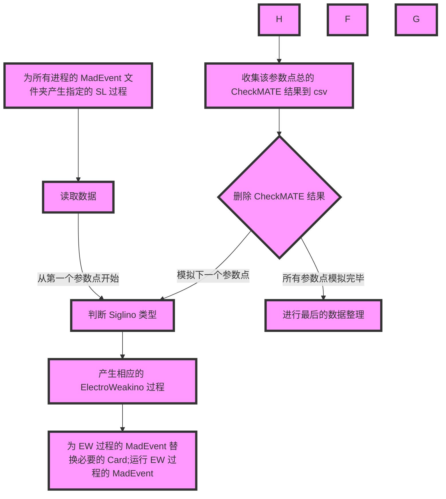
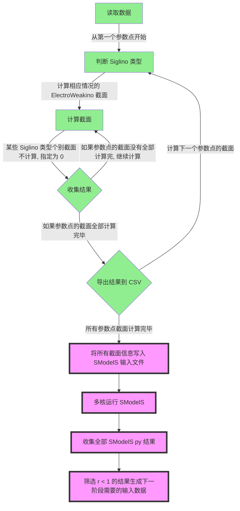
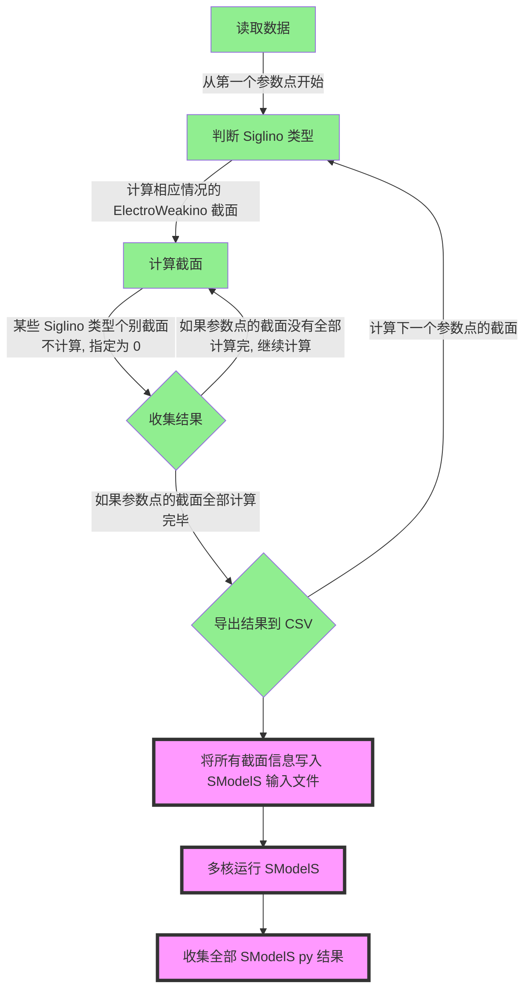
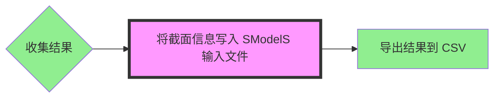
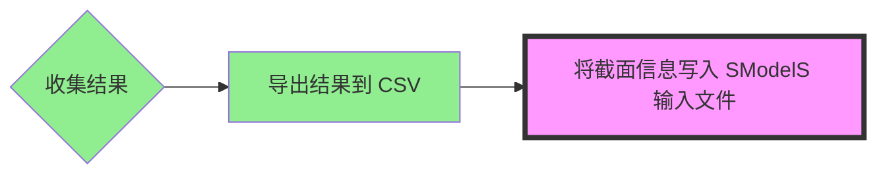
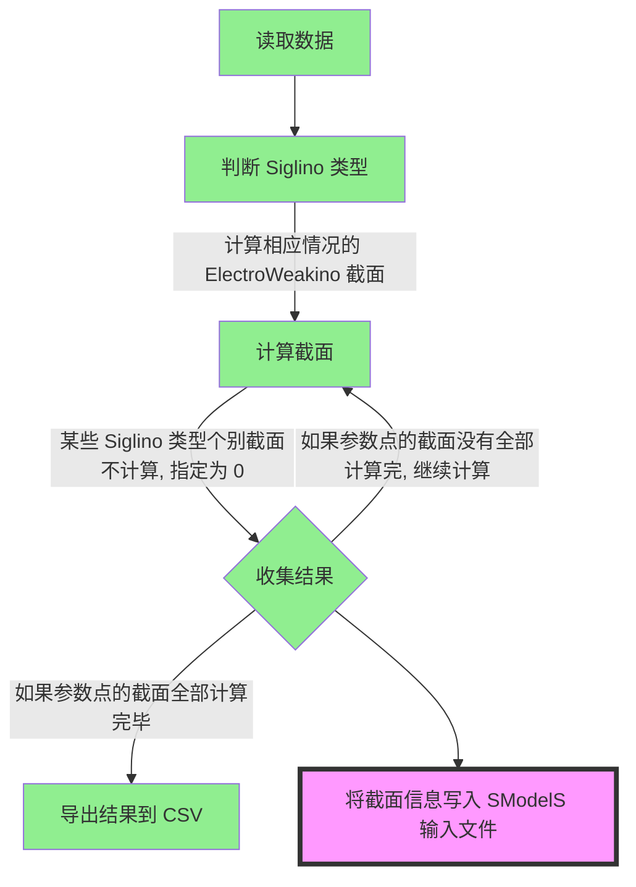
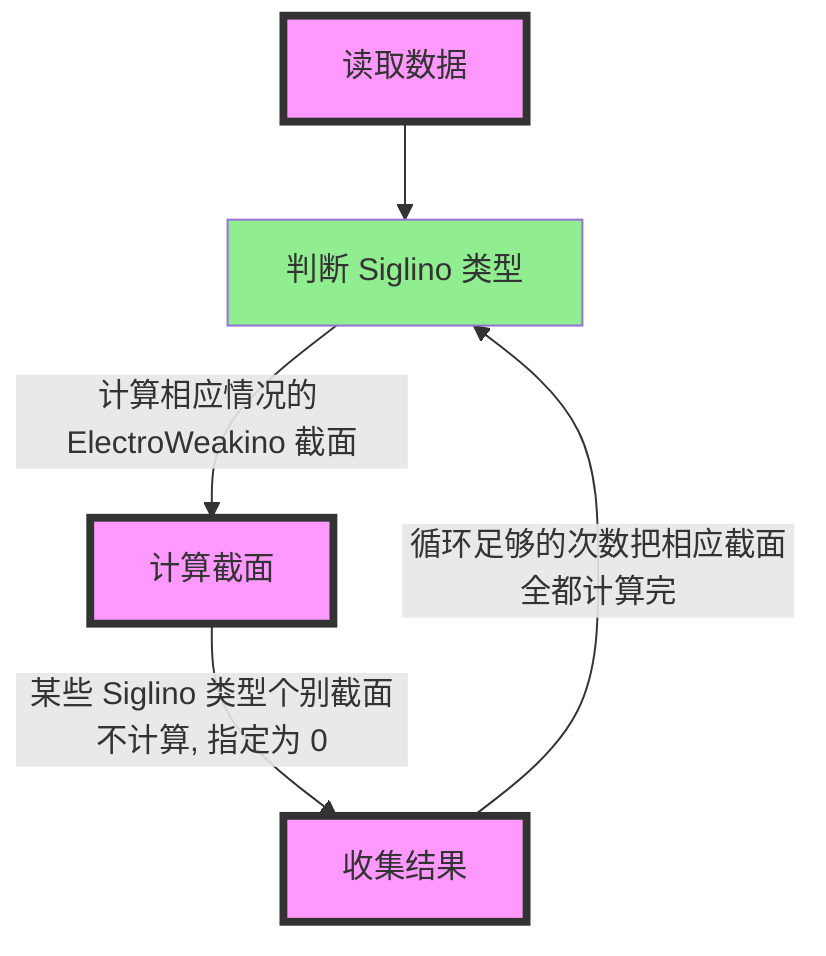
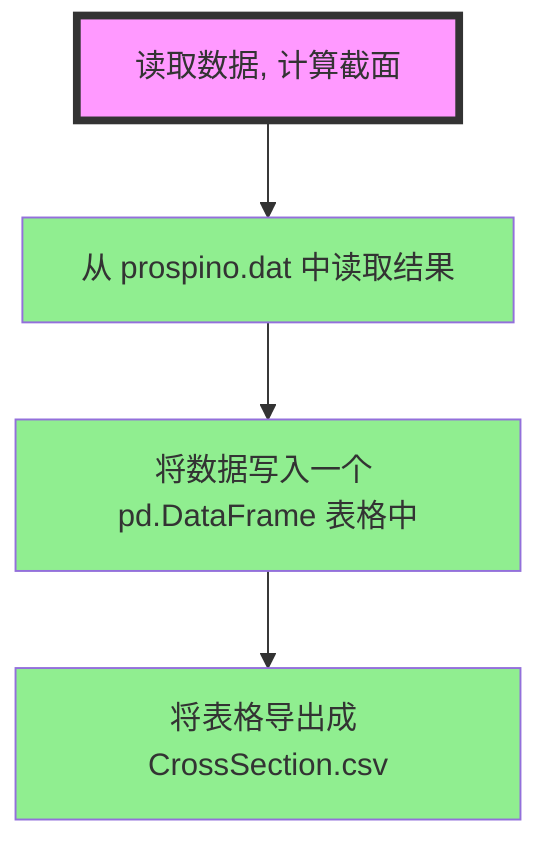
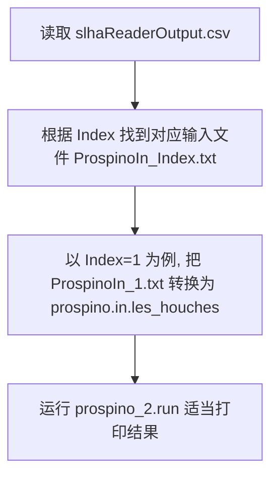
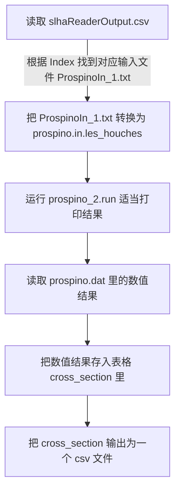

# SUSYphe

SUSY phenomenology on LHC

这个项目的目的是重写 prospino-smodels-madgraph-checkmate 的自动化程序。

当前任务：控制 prospino2 的类

**推送代码发起 Pull request 时一定要推送到自己对应的那个分支上，不要推送到 main 分支，否则会影响代码审核和合并的工作量。**

## 2023/11/08

现在开始 Madgraph 和 Checkmate 控制程序的编写

**这个程序最好是直接用面向对象的方案编写，否则后期修改起来可能会有些麻烦。**

文件结构暂时如下：

```text
MC_Program/
├── MC_Program.py
├── MC_input.csv
├── SLHA/
│   └── SPhenoSPC_*.txt
├── Process_script/
│   ├── Process_EW_n1
│   ├── Process_EW_n2
│   ├── Process_EW_n3
│   ├── Process_EW_n4
│   ├── Process_EW_n5
│   └── Process_SL
├── MadGraph/
│   └── MG5_aMC_v2_6_4/
|-- Events/
│   └── MadEvent_*
│       ├── EW_event
│       └── SL_event
├── CheckMATE/
│   └── CM_v2_26
├── Results/
│   └── CM_output.csv
```

`MC_input.csv` 是筛选出来需要进行 M-C 模拟的参数点信息，信息至少要包括：参数点编号，Siglino 是哪个 neutralino，提交给 CheckMATE 的截面。

`SLHA/` 文件夹中放置提交给 `MadEvent` 的 slha 文件

`Process_script/` 用于 `MadGraph` 产生过程脚本

`MadGraph/` 文件夹内放置 `MadGraph` 程序包，可能有多份

`Events/` 文件夹用虚线表示，表示该文件可能存在于任意硬盘位置上

`CheckMATE/` 文件夹内放置 `CheckMATE` 程序包，肯呢个有多份

`Results/` 文件夹内存放模拟的结果

**大致流程：**



> **注意：** 如果不考虑 SL 过程，那么就需要把相应的 SL 流程删除掉。

## 2023/10/29

进入到 Prospino-SModelS 的收尾工作

另外，需要一个安装脚本，安装多份的 Madgraph 和 Checkmate。



之后 Prospino 和 SModelS 的流程就将被浓缩成一个流程单元，进入到 Madgraph 和 Checkmate 的环节。

## 2023/10/20

根据实际的推进情况，现在定为以下流程



## 2023/10/04

更新流程图和文件结构。

下面的总流程图只是一个示意，**收集结果**后的内容需要讨论，是将所有截面计算完毕后再写入 `SModelS` 输入，还是当计算完一个参数点后立刻写入 `SModelS` 输入。







下面的文件结构仅供参考

- 这里把 `Program_CrossSection.py` 暂时改名为 `Program.py`
- 文件结构中添加了 `SModelS_Input` 文件夹，用于存放 `SModelS` 输入文件
- 文件结构中添加了 `SModelS_Output` 文件夹，用于存放 `SModelS` 输出文件

```text
Our_Program/
├── Program.py
├── Prospino_Input/
│   └── ProspinoIn_1.txt
├── Cross_Section/
│   └── Prospino2_*/
│      └── prospino_2.run
├── Prospino_Run/
│   ├── Pro2_subroutines/
│   ├── prospino.in.les_houches
│   └── prospino.dat
├── Results/
│   └── CrossSection.csv
├── SModelS_Input/
│   └── SModelS_1.slha
├── SModelS_Output/
│   └── SModelS_1.smodels
└── slhaReaderOutput.csv
```

## 2023/09/23

更新流程图和文件结构，**浅绿色方框**中的内容为新的目标

总的来说就是，分类讨论 Siglino 为不同 neutralino 时的情况，计算相关截面并处理某些情况下跳过某些截面的情况



下面的文件结构仅供参考

```text
Our_Program/
├── Program_CrossSection.py
├── Prospino_Input/
│   └── ProspinoIn_1.txt
├── Cross_Section/
│   └── Prospino2_*/
│      └── prospino_2.run
├── Prospino_Run/
│   ├── Pro2_subroutines/
│   ├── prospino.in.les_houches
│   └── prospino.dat
├── Results/
│   └── CrossSection.csv
└── slhaReaderOutput.csv
```

## 2023/09/18

更新流程图，设定新的目标，**浅绿色方框** 中的内容为新的目标



**现在的文件结构是：**

```text
Our_Program/
├── Program_CrossSection.py
├── Prospino_Input/
│   ├── ProspinoIn_1.txt
├── Prospino2/
│   ├── prospino_main.f90
│   ├── prospino.in.les_houches
│   ├── prospino.dat
│   └── prospino_2.run
├── Prospino2.tar.gz
├── CrossSection.csv
└── slhaReaderOutput.csv
```

## 2023/09/15

更新流程图，以函数功能作为其基本组成单元，使其表达的更清晰。

现在目标就是先让 Prospino 正确地运行某一个参数点的某一个截面，得出结果，但是目前先不涉及收集结果的操作。下面的每一个方框代表一个函数的功能，如果有必要也可以适当把复数功能整合进一个函数。



同时更新的还有一个名字暂定为 `Our_Program` 的文件夹，相关的文件结构都已经配置好，Prospino2 也已经安装好，并编译为计算 $\tilde{\chi}_1^- \bar{\tilde{\chi}}_1^+$ 截面，因此只需要完成流程图内程序的编写，完成测试即可。

流程图中提到的功能可以参考 `Test_Point/Reference/cs_smodels_nmssm_staustau.py` 文件中第 13 行，第 31 或 39 行，以及第 47 行的函数中的某些写法。

**现在的文件结构是：**

```text
Our_Program/
├── Program_CrossSection.py
├── Prospino_Input/
│   ├── ProspinoIn_1.txt
├── Prospino2/
│   ├── prospino_main.f90
│   ├── prospino.in.les_houches
│   ├── prospino.dat
│   └── prospino_2.run
├── Prospino2.tar.gz
└── slhaReaderOutput.csv
```

## 2023/09/08

目前要实现使用 `Prospino` 执行单进程计算单个样本单个截面的功能

现在假定：

- 包含所有样本数据的 `slhareaderOutput.csv` 文件已经存在。
- 所有要计算截面的参数点的标准输入谱 `ProspinoIn_*.txt` 已经存在，并且存放在 `Prospino_Input` 文件夹里，暂时先只考虑一个参数点 `ProspinoIn_1.txt` 的情况。
- `Prospino2` 程序安装完毕。

`Prospino` 程序中有四个比较重要的文件要用到：

- 配置文件 prospino_main.f90
- 输入文件 prospino.in.les_houches
- 执行文件 prospino_2.run
- 结果文件 prospino.dat

`prospino_main.f90` 修改后需要重新编译，现在先设定好任一截面，提前编译好。

### 文件结构

```text
Our_Program/
├── Program_CrossSection.py
├── Prospino_Input/
│   ├── ProspinoIn_1.txt
├── Prospino2/
│   ├── prospino_main.f90
│   ├── prospino.in.les_houches
│   ├── prospino.dat
│   └── prospino_2.run
└── slhaReaderOutput.csv
```

### Program_CrossSection.py 流程图


