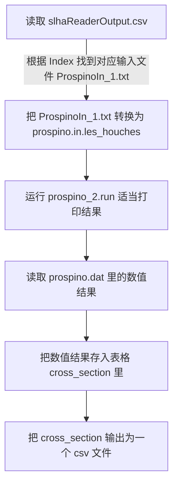

# SUSYphe
SUSY phenomenology on LHC

这个项目的目的是重写 prospino-smodels-madgraph-checkmate 的自动化程序。

当前任务：控制 prospino2 的类

# 推送代码发起 Pull request 时一定要新建分支，不要推送到 main 分支，否则会影响代码审核和合并的工作量。

## 2023/09/08

目前要实现使用 `Prospino` 执行单进程计算单个样本单个截面的功能

现在假定：

- 包含所有样本数据的 `slhareaderOutput.csv` 文件已经存在。
- 所有要计算截面的参数点的标准输入谱 `ProspinoIn_*.txt` 已经存在，并且存放在 `Prospino_Input` 文件夹里，暂时先只考虑一个参数点 `ProspinoIn_1.txt` 的情况。
- `Prospino2` 程序安装完毕。

`Prospino` 程序中有四个比较重要的文件要用到：

- 配置文件 prospino_main.f90
- 输入文件 prospino.in.les_houches
- 执行文件 prospino_2.run
- 结果文件 prospino.dat

`prospino_main.f90` 修改后需要重新编译，现在先设定好任一截面，提前编译好。

### 文件结构

```text
Our_Program/
├── Program_CrossSection.py
├── Prospino_Input/
│   ├── ProspinoIn_1.txt
├── Prospino2/
│   ├── prospino_main.f90
│   ├── prospino.in.les_houches
│   ├── prospino.dat
│   └── prospino_2.run
└── slhaReaderOutput.csv
```

### Program_CrossSection.py 流程图


