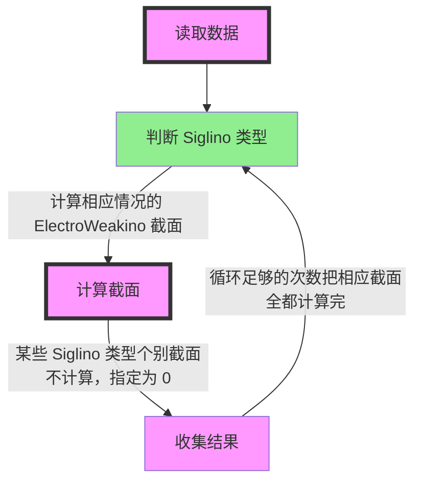
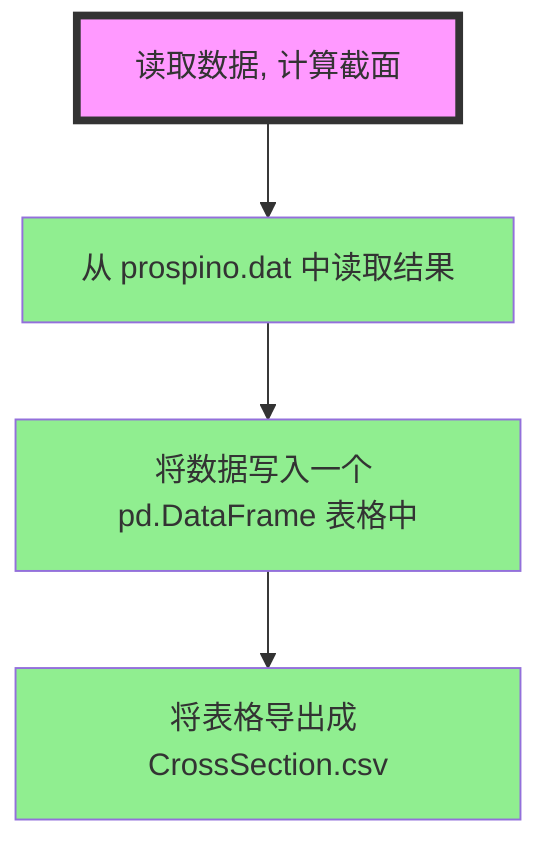
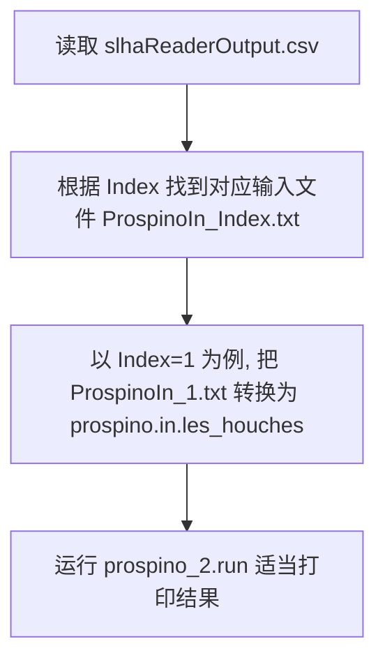
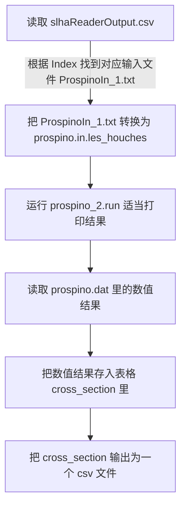

# Work Flow

## 2023/09/23

**流程图**：



**文件结构**：

```text
Our_Program/
├── Program_CrossSection.py
├── Prospino_Input/
│   └── ProspinoIn_1.txt
├── Cross_Section/
│   └── Prospino2_*/
│      └── prospino_2.run
├── Prospino_Run/
│   ├── Pro2_subroutines/
│   ├── prospino.in.les_houches
│   └── prospino.dat
├── Results/
│   └── CrossSection.csv
└── slhaReaderOutput.csv
```

## 2023/09/18

**流程图**：



**文件结构**：

```text
Our_Program/
├── Program_CrossSection.py
├── Prospino_Input/
│   ├── ProspinoIn_1.txt
├── Prospino2/
│   ├── prospino_main.f90
│   ├── prospino.in.les_houches
│   ├── prospino.dat
│   └── prospino_2.run
├── Prospino2.tar.gz
├── CrossSection.csv
└── slhaReaderOutput.csv
```

## 2023/09/15

**流程图**：



**文件结构**：

```text
Our_Program/
├── Program_CrossSection.py
├── Prospino_Input/
│   ├── ProspinoIn_1.txt
├── Prospino2/
│   ├── prospino_main.f90
│   ├── prospino.in.les_houches
│   ├── prospino.dat
│   └── prospino_2.run
├── Prospino2.tar.gz
└── slhaReaderOutput.csv
```

## 2023/09/08

**文件结构**：

```text
Our_Program/
├── Program_CrossSection.py
├── Prospino_Input/
│   ├── ProspinoIn_1.txt
├── Prospino2/
│   ├── prospino_main.f90
│   ├── prospino.in.les_houches
│   ├── prospino.dat
│   └── prospino_2.run
└── slhaReaderOutput.csv
```

**Program_CrossSection.py 流程图**：


