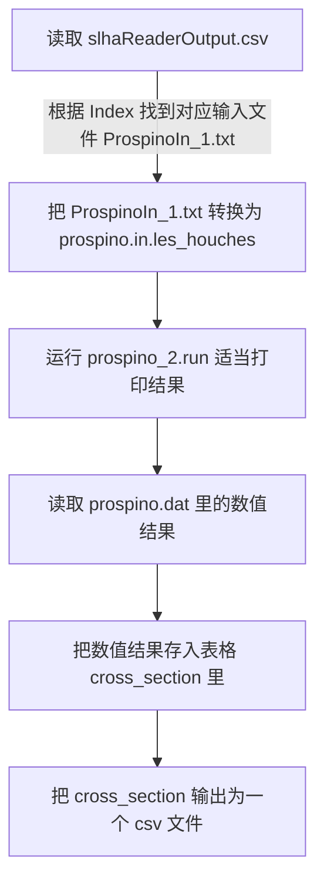

# Work Flow

## 2023/09/15

更新流程图

## 2023/09/08

### 文件结构

```text
Our_Program/
├── Program_CrossSection.py
├── Prospino_Input/
│   ├── ProspinoIn_1.txt
├── Prospino2/
│   ├── prospino_main.f90
│   ├── prospino.in.les_houches
│   ├── prospino.dat
│   └── prospino_2.run
└── slhaReaderOutput.csv
```

### Program_CrossSection.py 流程图


